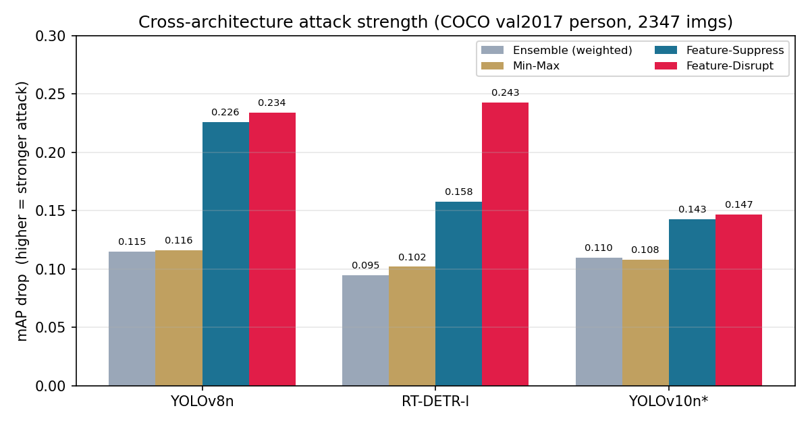
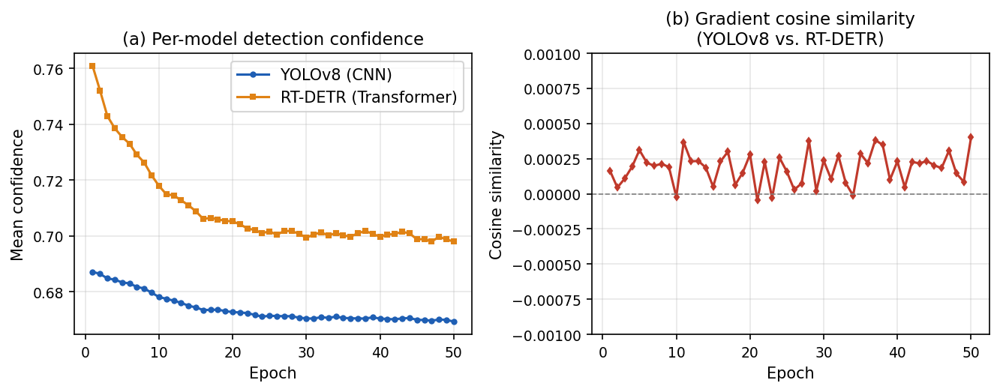
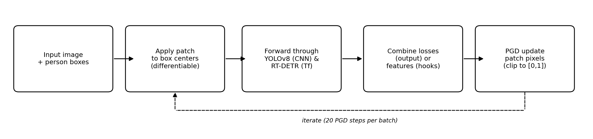
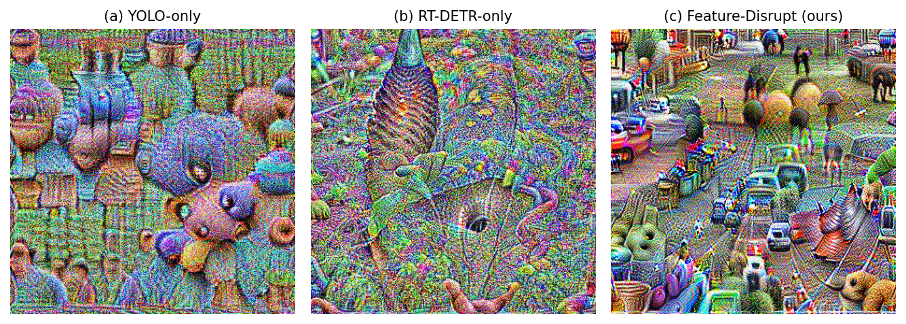

# Cross-Architecture Adversarial Patches for Object Detectors

A single adversarial patch that evades **both a CNN detector (YOLOv8)** and a
**Transformer detector (RT-DETR)** at the same time.

> Computer Vision term project (2026 Spring), Team 38 — Youngjae Kim.
> Full write-up: [`docs/report.pdf`](docs/report.pdf) · slides: [`docs/slides.pdf`](docs/slides.pdf)

---

## TL;DR

- Combining the two detectors' **output losses** (weighted sum / min–max) gives
  **limited and combination-agnostic** results.
- **Why?** The two architectures' gradients w.r.t. the patch are **near-orthogonal**
  (cosine ≈ 0) throughout training — averaging independent directions yields a weak
  compromise.
- **Fix:** attack **shared intermediate features** instead of the output loss. A single
  *feature-disruption* patch roughly **doubles** the attack on both detectors while
  staying **balanced**, and transfers best to an **unseen** detector (YOLOv10).
- The feature-level gradients are still orthogonal — the gain comes from corrupting a
  **shared representation**, not from aligning gradients.

## Results (mAP drop, full COCO val2017 person subset — higher = stronger attack)

| Patch | YOLOv8n | RT-DETR-l | YOLOv10n (unseen) |
|---|---|---|---|
| Ensemble (weighted) | 0.115 | 0.095 | 0.110 |
| Min-Max | 0.116 | 0.102 | 0.108 |
| **Feature-Suppress** | **0.226** | **0.158** | **0.143** |
| **Feature-Disrupt** | **0.234** | **0.243** | **0.147** |



**Gradient orthogonality** — cosine similarity between the two detectors' gradients
stays ≈ 0 across all epochs:



## Method



A patch is composed onto person boxes, passed through both detectors, and updated by PGD
to minimize a combined objective. We compare:

1. **Output-loss ensemble** — `L = α·L_YOLO + β·L_RT-DETR` (weighted) or `max(L_YOLO, L_RT-DETR)` (min–max).
2. **Feature-level attack** — disrupt (push features away from the clean ones) or
   suppress (minimize feature activations) on hooked intermediate backbone layers.

## Repository structure

```
.
├── 00_prepare_data.py     # download COCO val2017, build person subset
├── 01_train_patch.py      # single-model & weighted-ensemble patches (--mode)
├── 02_evaluate.py         # mAP-drop evaluation / --compare across patches
├── 03_train_balanced.py   # min-max balancing + gradient-cosine logging
├── 04_train_feature.py    # feature-level attack (disrupt / suppress)  <- proposed
├── output/                # trained patches (.pt/.png), loss curves, metrics
├── docs/                  # report, slides, figures
└── requirements.txt
```

## Setup

```bash
pip install -r requirements.txt
python 00_prepare_data.py          # downloads COCO val2017 (~800 MB) into data/
```

## Usage

```bash
# baselines / weighted ensemble
python 01_train_patch.py --mode yolo      --epochs 50
python 01_train_patch.py --mode rtdetr    --epochs 50
python 01_train_patch.py --mode ensemble  --alpha 0.5 --beta 0.5 --epochs 50

# min-max balancing (logs gradient cosine similarity)
python 03_train_balanced.py --method minmax --epochs 50

# feature-level attack (proposed)
python 04_train_feature.py --objective disrupt  --epochs 50
python 04_train_feature.py --objective suppress --epochs 50

# evaluate all patches with mAP drop
python 02_evaluate.py --compare --n 2347
```

## Generated patches



## Notes & limitations

- Detectors are frozen pretrained models (Ultralytics YOLOv8n / YOLOv10n, RT-DETR-L);
  only the patch is optimized with PGD.
- Absolute drops (~0.24) are not full evasion; the unseen model (YOLOv10) is another CNN,
  so an unseen Transformer is not yet tested; a single detector pair is studied; no
  Expectation-over-Transformation (physical robustness) is applied.

## Acknowledgments

Built with [Ultralytics](https://github.com/ultralytics/ultralytics) and the
[COCO](https://cocodataset.org) dataset. Term project for the Computer Vision course.
